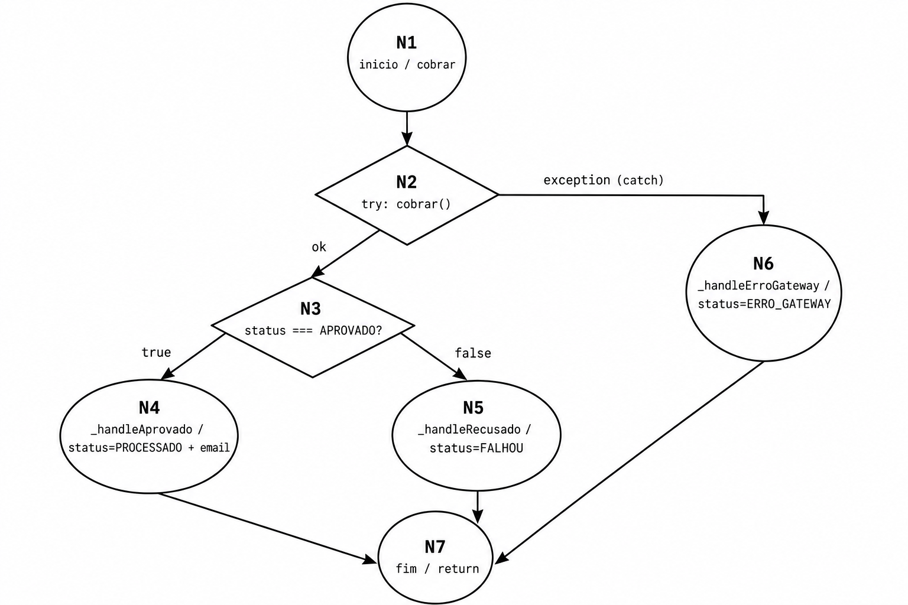

# Relatório das Fases — O Apocalipse do Delivery (EntregasJá)

Documento único cobrindo as **Fases 1, 3 e 4**. A **Fase 2** é majoritariamente
código (ver `features/`, `src/` e `tests/`), com referência ao DER em
[`especificacao.md`](especificacao.md).

Índice:
- [Fase 1 — Análise Estrutural, Complexidade e Métricas](#fase-1--análise-estrutural-complexidade-e-métricas)
- [Fase 3 — Teste de Mutação](#fase-3--teste-de-mutação)
- [Fase 4 — Engenharia do Caos e Performance (SRE)](#fase-4--engenharia-do-caos-e-performance-sre)

---

# FASE 1 — Análise Estrutural, Complexidade e Métricas

**Componente auditado:** `CheckoutService.processar(pedido)` (`src/services/CheckoutService.js`)

## 1. Objetivo
Auditar o componente legado de Checkout **antes** da refatoração, produzindo:
1. O **Grafo de Fluxo de Controle (GFC)** do método principal.
2. O cálculo da **Complexidade Ciclomática `V(G)`**.
3. Um **documento formal de estimativa** de esforço de teste (Test Case Points).

## 2. Código sob análise
A lógica de decisão concentra-se em `processar`. Os métodos extraídos
(`_handleAprovado`, `_handleRecusado`, `_handleErroGateway`) são lineares (`V(G)=1`):

```js
async processar(pedido) {
  try {
    const resposta = await this.gatewayPagamento.cobrar(pedido.valor, pedido.cartao);
    if (resposta.status === 'APROVADO') {      // decisão D1
      return await this._handleAprovado(pedido);
    } else {
      return await this._handleRecusado(pedido);
    }
  } catch (error) {                            // desvio implícito D2 (exceção)
    return await this._handleErroGateway(pedido, error);
  }
}
```

## 3. Grafo de Fluxo de Controle (GFC)



| Nó | Significado |
| :--- | :--- |
| **N1** | Início; chamada `await gatewayPagamento.cobrar(...)` |
| **N2** | Decisão do `try`: resolve (→N3) ou lança exceção (→N6 via `catch`) |
| **N3** | Decisão `if (resposta.status === 'APROVADO')` |
| **N4** | `_handleAprovado` → `PROCESSADO`, salva e dispara e-mail assíncrono |
| **N5** | `_handleRecusado` → `FALHOU`, salva, **não** envia e-mail |
| **N6** | `_handleErroGateway` (catch) → `ERRO_GATEWAY`, salva, **não** envia e-mail |
| **N7** | Saída / `return` |

**Arestas (8):** N1→N2, N2→N3, N2→N6, N3→N4, N3→N5, N4→N7, N5→N7, N6→N7. **Nós:** 7.

## 4. Cálculo da Complexidade Ciclomática `V(G)`

```
Fórmula 1 (arestas-nós):  V(G) = E - N + 2 = 8 - 7 + 2 = 3
Fórmula 2 (predicados):   V(G) = P + 1     = 2 + 1     = 3   (D1: if; D2: catch)
Fórmula 3 (regiões):      V(G) = regiões fechadas       = 3
```

> ## **V(G) = 3** → 3 caminhos independentes; abaixo do limite de risco de McCabe (≤10).

## 5. Caminhos Independentes (Base Path Testing)

| Caminho | Sequência | Condição | Status final | Caso de teste |
| :--- | :--- | :--- | :--- | :--- |
| **CT-01** | N1→N2→N3→N4→N7 | `APROVADO` | `PROCESSADO` | `CheckoutService.test.js` › *N4* |
| **CT-02** | N1→N2→N3→N5→N7 | `RECUSADO` | `FALHOU` | `CheckoutService.test.js` › *N5* |
| **CT-03** | N1→N2→N6→N7 | exceção/timeout | `ERRO_GATEWAY` | `CheckoutService.test.js` › *N6* |

A suíte cobre **exatamente os 3 caminhos** previstos por `V(G)=3` (Basis Path Coverage 100%).
A função auxiliar `validarPayload` (RF01, em `src/server.js`) tem `V(G)=8` (7 condições + 1) e é
coberta por `validarPayload.test.js`. As regras RN04–RN07 (retry/circuit breaker) são tratadas
na camada de infraestrutura da **Fase 4**.

### 5.1. Prova de Cobertura de Arestas (Edge Coverage = 100%)
Os 3 caminhos-base não cobrem apenas os nós: eles exercitam **todas as 8 arestas** do GFC,
garantindo **100% de cobertura de arestas** (equivalente à cobertura de decisão/branch):

| Aresta | CT-01 | CT-02 | CT-03 | Coberta? |
| :--- | :---: | :---: | :---: | :---: |
| N1 → N2 | ✓ | ✓ | ✓ | ✅ |
| N2 → N3 (gateway respondeu) | ✓ | ✓ | | ✅ |
| N2 → N6 (exceção/catch) | | | ✓ | ✅ |
| N3 → N4 (APROVADO) | ✓ | | | ✅ |
| N3 → N5 (não-APROVADO) | | ✓ | | ✅ |
| N4 → N7 | ✓ | | | ✅ |
| N5 → N7 | | ✓ | | ✅ |
| N6 → N7 | | | ✓ | ✅ |
| **Total** | | | | **8/8 = 100%** |

Esse resultado teórico é confirmado na prática pelo **Jest**: `CheckoutService.js` apresenta
**100% de Branch coverage** (`% Branch = 100`), ou seja, todos os ramos de decisão são executados.

### 5.2. Estratégia de Testes adotada
A escolha dos casos não foi ad-hoc; seguiu técnicas formais de projeto de teste:

| Técnica | Onde foi aplicada |
| :--- | :--- |
| **Teste de Caminho Básico (Basis Path Testing)** | Deriva CT-01/02/03 a partir do `V(G)=3` do `processar`, garantindo cobertura de arestas. |
| **Partição de Equivalência** | Respostas do gateway agrupadas em classes: aprovado / recusado / falha de infra. |
| **Análise de Valor-Limite** | `validarPayload`: `valor = 0`, negativo e positivo; e-mail com/sem `@`; cartão sem CVV. |
| **Teste baseado em estado (Stubs)** | Stubs controlam o **estado** retornado pelo gateway (APROVADO/RECUSADO/exceção). |
| **Teste baseado em interação (Mocks)** | Mocks verificam o **comportamento**: e-mail disparado só no sucesso; logs de erro. |
| **Teste de Mutação (Fase 3)** | Valida a *eficácia* da suíte: 100% dos mutantes mortos (não só cobertura de linha). |

> Resumo para a defesa: cada um dos 3 caminhos independentes vira 1+ caso de teste; juntos eles
> dão **100% de cobertura de nós e de arestas**, e a robustez é comprovada pelo **Mutation Score
> de 100%** — cobertura alta *com* eficácia comprovada.

## 6. Estimativa de Esforço de Teste (Test Case Points — TCP)

| Cenário de teste | Complexidade | Peso (PT) |
| :--- | :--- | :--- |
| CT-01 — APROVADO (salva + e-mail assíncrono) | Média | 4 |
| CT-02 — RECUSADO (salva + bloqueia e-mail) | Média | 4 |
| CT-03 — ERRO_GATEWAY (catch + falha controlada) | Alta | 6 |
| Retry/recuperação (Fluxo 3 — Fase 4) | Alta | 6 |
| Validação de payload (RF01) | Média | 4 |
| Builder — padrões e variações | Baixa | 2 |
| Testes de mutação (mutant-killers) | Alta | 6 |
| **Total de Pontos de Teste (TPT)** | | **32** |

Produtividade adotada: **0,5 h/PT** → esforço base = 32 × 0,5 = **16 h**.

| Atividade | % | Horas |
| :--- | :--- | :--- |
| Esforço base (escrita + execução) | 100% | 16,0 h |
| Análise estrutural (Fase 1) | +20% | 3,2 h |
| Configuração de ambiente | +15% | 2,4 h |
| Análise/eliminação de mutantes (Fase 3) | +25% | 4,0 h |
| Documentação e relatórios | +15% | 2,4 h |
| **Esforço total estimado** | | **≈ 28 h/homem** |

**Recursos:** 2 engenheiros de QA (par TDD); prazo ≈ **2–3 dias úteis**; ferramentas Node 18+,
Jest, Stryker, Cucumber, k6/Toxiproxy (Fase 4).

---

# FASE 3 — Teste de Mutação

**Ferramenta:** StrykerJS 9.6.1 (runner Jest, `coverageAnalysis: perTest`)
**Escopo mutado:** `src/services/CheckoutService.js` e `src/builders/PedidoBuilder.js`

## 1. Resultado final

| Arquivo | Mutantes | Mortos | Sobreviventes | Sem cobertura | Score |
| :--- | :--- | :--- | :--- | :--- | :--- |
| `PedidoBuilder.js` | 16 | 16 | 0 | 0 | **100%** |
| `CheckoutService.js` | 20 (+1 RuntimeError) | 20 | 0 | 0 | **100%** |
| **Total** | **36 válidos** | **36** | **0** | **0** | **100,00%** |

Meta da rubrica: **≥ 90%**. Resultado: **100%** (relatório em `reports/mutation/mutation.html`).

## 2. Justificativa técnica de mutantes equivalentes

**Não há mutantes equivalentes nem sobreviventes** — os 36 mutantes válidos foram mortos por
asserções de comportamento. Casos que exigem nota técnica:

- **Mutante `#36` (RuntimeError):** mutação `ObjectLiteral` em `module.exports = { CheckoutService }`
  → `{}`, que quebra a importação em `server.js` (`CheckoutService is not a constructor`). É um
  mutante **inválido** (impede execução), corretamente **excluído** do score pelo Stryker. **Não** é
  equivalente, pois muda o comportamento.
- **Por que não há equivalentes nas regras de negócio:** cada efeito observável (status final do
  pedido, envio/bloqueio de e-mail, mensagens de log) tem ao menos uma asserção — não sobra espaço
  para mutações comportamentalmente silenciosas.

## 3. Histórico (sobreviventes da 1ª execução → mortos)

| Mutante original | Teste que o matou (`mutant-killers.test.js`) |
| :--- | :--- |
| Campos do cartão padrão vazios (M1–M4) | "cartão padrão deve ter número/validade/CVV não vazio" |
| `comCartao()` / `semValor()` sem cobertura | testes específicos de cada método do Builder |
| `.catch` do e-mail (M5) | "deve logar erro quando o envio de e-mail falha" |
| mensagem de erro do gateway (M6) | "deve logar mensagem específica quando o gateway falha" |

## 4. Observação de escopo
`validarPayload` (`server.js`) não está no `mutate` (foco da fase é a lógica de negócio do
`CheckoutService` + a fábrica de dados). Incluí-la exigiria isolá-la em módulo próprio para
evitar o RuntimeError de carga do Express durante a mutação.

---

# FASE 4 — Engenharia do Caos e Performance (SRE)

## 1. Topologia do experimento
```
                         injeção de caos (toxics)
                                   │
  k6 ─HTTP─► Checkout (Express :3000) ─HTTP─► Toxiproxy (:21000) ─► Gateway Externo (:4000)
                       │                              ▲
                       └── ConfigCache (single-flight)┘  "banco" lento simulado
```

## 2. SLI / SLO

| SLI | SLO | Threshold no k6 |
| :--- | :--- | :--- |
| Latência p95 | **< 5000 ms** | `http_req_duration: ['p(95)<5000']` |
| Taxa de erro | **< 5%** | `http_req_failed: ['rate<0.05']` |

> O DER define meta interna mais rígida (p95 < 2500ms); o k6 usa o limite oficial do enunciado (5s).

## 3. Mecanismos de blindagem (isolados do escopo de mutação)

**`src/gateways/HttpGatewayPagamento.js` (RN04–RN07):**
- **Timeout** 2000ms por tentativa (`AbortController`).
- **Retry** até 3x em falhas de infra (timeout/5xx/conexão); 4xx (negócio) não repete.
- **Backoff + Jitter** entre tentativas (anti-thundering-herd).
- **Circuit Breaker**: abre com taxa de erro >50% (fail-fast) → MEIO_ABERTO após cooldown → FECHA no 1º sucesso.

**`src/cache/ConfigCache.js` (Thundering Herd):**
- **Single-flight (coalescing):** sob N cache-miss simultâneos, apenas 1 leitura vai ao banco.
- **Backoff + Jitter** nas recargas com falha.

## 4. Cenários de Caos

- **Gateway Lento (+5000ms):** `node chaos/toxiproxy/toxics.js gateway-lento`. Como o timeout é
  2000ms, as chamadas estouram, o breaker abre e passa a falhar rápido (500 amigável em ms) — o
  Express **não colapsa** (degradação graciosa).
- **Thundering Herd:** `k6 run chaos/k6/thundering-herd.js` (flush + ~10.000 req). `GET /health`
  mostra `cache.leiturasNoBanco` crescendo pouquíssimo — single-flight protegeu o banco.

## 5. Medição de MTTR
```bash
node chaos/mttr/medir-mttr.js --falha-ms 12000   # injeção via /admin/latencia (sem Docker)
node chaos/mttr/medir-mttr.js --toxiproxy        # injeção via Toxiproxy
```
```
MTTD (detecção)            = t_degraded  − t_falha
MTTR (recuperação)         = t_recovered − t_reparo
Duração total do incidente = t_recovered − t_falha
```

### 5.1. Resultado REAL medido
Experimento executado (falha de 12s, SLO 5000ms):

| Métrica | Valor medido |
| :--- | :--- |
| **MTTD** (tempo de detecção) | **3,9 s** |
| **MTTR** (tempo de recuperação) | **4,8 s** |
| **Duração total do incidente** | **16,8 s** |

Trecho da sonda que comprova a **degradação graciosa** (fail-fast do breaker):
```
[3.0s] >>> FALHA INJETADA: Gateway Lento (+5000ms)
[6.9s] FAIL status=500 3375ms   <- timeout+retry antes do breaker abrir
[13.3s] FAIL status=500 2ms     <- breaker ABERTO: falha em 2ms (não pendura 5s!)
[14.9s] FAIL status=500 1ms
[15.0s] >>> REPARO APLICADO
[18.2s] OK  status=200 311ms     <- breaker fechou, latência normal
[19.9s] *** RECUPERAÇÃO CONFIRMADA
```
Quando o breaker abre, as requisições falham em **1–2 ms** em vez de segurar conexões por 5 s —
é isso que impede a exaustão do event loop e o colapso em cascata.

## 6. Resultados REAIS do k6 (executados)

Os testes foram **executados de verdade** com k6 v2.0.0. Relatórios com gráficos em
`reports/k6/` (`relatorio-baseline.html` e `relatorio-caos.html`); resumos em JSON
(`resumo-baseline.json`, `resumo-caos.json`).

> Execução **sem Docker/Toxiproxy**: o "Gateway Lento" foi injetado em runtime pelo
> endpoint `POST /admin/latencia` do gateway externo, orquestrado por
> `chaos/orquestra-caos-demo.js` (injeta 5000ms no platô e restaura depois). Quem tiver
> Docker pode usar o Toxiproxy (seção 7) — o efeito é o mesmo.

### 6.1. Baseline (gateway saudável, ~300ms) — `relatorio-baseline.html`
| Métrica | Resultado | SLO | Veredito |
| :--- | :--- | :--- | :---: |
| p95 da latência | **315 ms** | < 5000 ms | ✅ |
| Taxa de erro | **0,00%** | < 5% | ✅ |
| Requisições | 32.256 (322 req/s) | — | — |

**Todos os SLOs aprovados** sob carga de 150 VUs.

### 6.2. Caos (Gateway Lento +5000ms injetado no platô) — `relatorio-caos.html`
| Métrica | Resultado | Interpretação |
| :--- | :--- | :--- |
| p95 da latência | **307 ms** | Mesmo sob caos, o serviço respondeu rápido (fail-fast do breaker) |
| Latência máxima | 3,46 s | Picos antes do breaker abrir; **nunca os 5s do gateway** |
| Requisições | **260.345** (2.597 req/s) | ~8× o baseline: falhas instantâneas em vez de conexões penduradas |
| Taxa de erro | 93,9% (na janela de caos) | Esperado — o gateway estava "fora"; o **importante é que o servidor não colapsou** |

**Prova de Degradação Graciosa:** com o gateway a 5000ms e timeout de 1500ms, o circuit
breaker **abriu e passou a falhar rápido** (p95 manteve-se ~300ms, throughput subiu para
2.597 req/s). O Express **permaneceu vivo e responsivo** — não houve exaustão de event
loop / colapso. Ao remover o tóxico, o breaker fechou e os SLOs voltaram (recuperação
visível no gráfico). É exatamente o comportamento desejado pelo enunciado.

## 6.3. Prova local complementar (Node puro, sem k6)
```bash
node chaos/smoke-resiliencia.js
```
Saída comprovada:
```
=== 1) Gateway Lento → Timeout/Retry/Circuit Breaker ===
OK  timeouts=2, fail-fast(breaker aberto)=4, estado=ABERTO
OK  recuperação: resposta=APROVADO, estado=FECHADO
=== 2) Thundering Herd → Single-flight protege o banco ===
OK  10000 requisições simultâneas → leiturasNoBanco=1 (coalescidas=9999)
```

## 7. Roteiro completo (Docker + k6)
> Pré-requisitos e instalação em [`../chaos/README.md`](../chaos/README.md).
```bash
docker compose -f chaos/toxiproxy/docker-compose.yml up -d   # 1. Toxiproxy
node chaos/gateway-externo.js                                 # 2. gateway externo (terminal A)
node chaos/toxiproxy/toxics.js setup                          # 3. cria o proxy
$env:GATEWAY_URL="http://localhost:21000"; node src/server.js # 4. checkout modo caos (terminal B)
k6 run chaos/k6/load-test.js                                  # 5. carga Black Friday (terminal C)
node chaos/toxiproxy/toxics.js gateway-lento                  # 6. injeta caos durante o platô
node chaos/toxiproxy/toxics.js limpar                         #    remove o caos
node chaos/mttr/medir-mttr.js                                 # 7. mede o MTTR
```

## 8. Checklist da rubrica (Fase 4)

| Item | Entregue |
| :--- | :--- |
| Config k6 realista (ramp-up/steady/ramp-down) | ✅ `chaos/k6/load-test.js` |
| Thresholds de SLO (p95 < 5s, erro < 5%) | ✅ |
| Cenário Thundering Herd | ✅ `chaos/k6/thundering-herd.js` + single-flight |
| Prova de Degradação Graciosa | ✅ timeout + retry + circuit breaker |
| Cálculo de MTTR | ✅ `chaos/mttr/medir-mttr.js` |
| Injeção de falhas (Toxiproxy) | ✅ Gateway Lento +5000ms e queda total |
